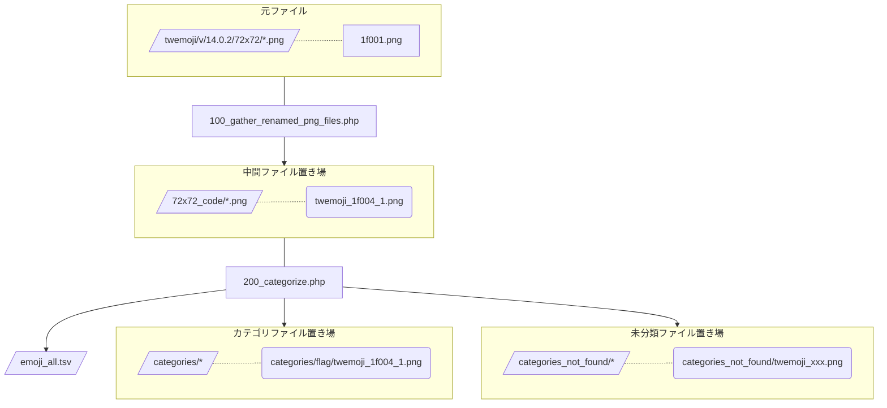
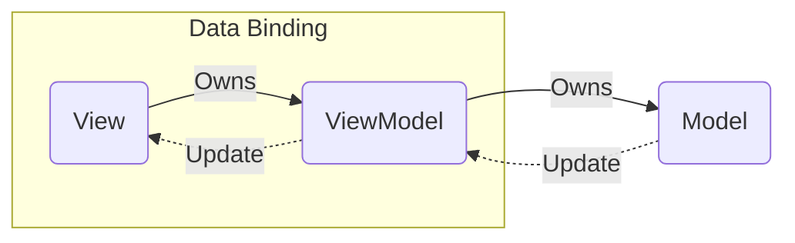
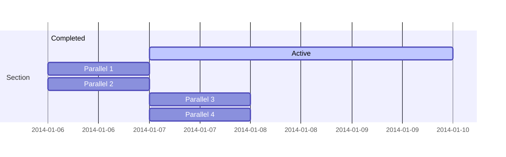

# mermaid_exam

```mermaid
flowchart TD

  SRC[/"twemoji/v/14.0.2/72x72/*.png"/]
  TEMP1[/"72x72_code/*.png"/]
  CATE1[/"categories/*"/]
  CATE_NF[/"categories_not_found/*"/]
  GATHER["100_gather_renamed_png_files.php"]
  CATEGORIZE["200_categorize.php"]

    subgraph 元ファイル
      direction LR
      SRC -.- 1f001.png
    end

    subgraph 中間ファイル置き場
      direction LR
      TEMP1 -.- TEXT1("twemoji_1f004_1.png")
    end

    subgraph カテゴリファイル置き場
      direction LR
      CATE1 -.- TEXT2("categories/flag/twemoji_1f004_1.png")
    end

    subgraph 未分類ファイル置き場
      direction LR
      CATE_NF -.- TEXT3("categories_not_found/twemoji_xxx.png")
    end

    元ファイル --- GATHER --> 中間ファイル置き場
    中間ファイル置き場 --- CATEGORIZE
    CATEGORIZE --> カテゴリファイル置き場
    CATEGORIZE --> 未分類ファイル置き場
    CATEGORIZE --> TSV[/"emoji_all.tsv"/]
```

```mermaid
flowchart LR
    subgraph Data Binding
    id1(View) -- Owns --> id2(ViewModel) -. Update .-> id1
    end
    id2 -- Owns -->  id3(Model) -. Update .-> id2

```

```mermaid
gantt
    section Section
    Completed :done,    des1, 2014-01-06,2014-01-08
    Active        :active,  des2, 2014-01-07, 3d
    Parallel 1   :         des3, after des1, 1d
    Parallel 2   :         des4, after des1, 1d
    Parallel 3   :         des5, after des3, 1d
    Parallel 4   :         des6, after des4, 1d
```

