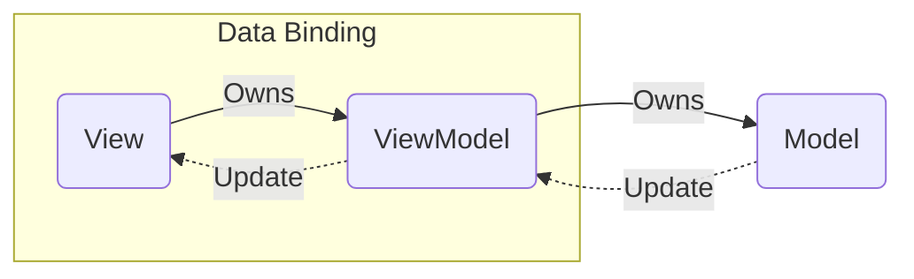
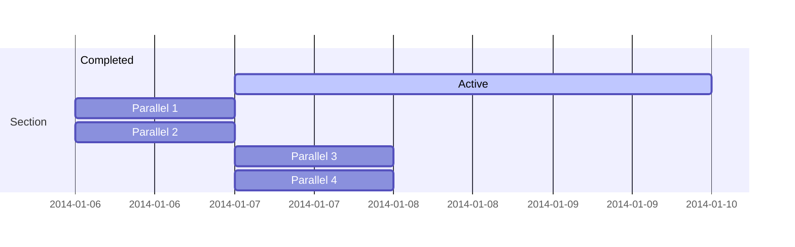

# mermaid_exam

```mermaid
flowchart LR
    subgraph Data Binding
    id1(View) -- Owns --> id2(ViewModel) -. Update .-> id1
    end
    id2 -- Owns -->  id3(Model) -. Update .-> id2

```

```mermaid
gantt
    section Section
    Completed :done,    des1, 2014-01-06,2014-01-08
    Active        :active,  des2, 2014-01-07, 3d
    Parallel 1   :         des3, after des1, 1d
    Parallel 2   :         des4, after des1, 1d
    Parallel 3   :         des5, after des3, 1d
    Parallel 4   :         des6, after des4, 1d
```
