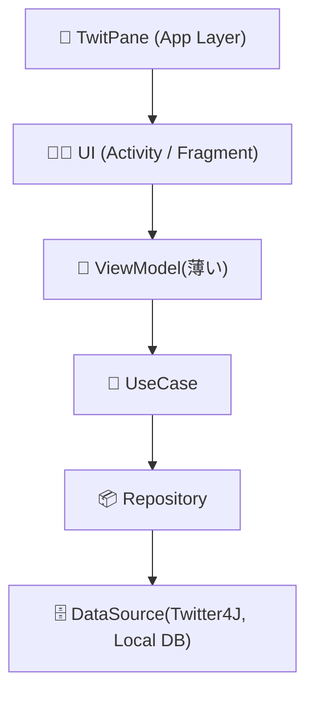

# TwitPane の構成

- TwitPane

```mermaid
flowchart TD
  APP["📱 TwitPane (App Layer)"]
  UI["🧑‍💻 UI (Activity / Fragment)"]
  VM["🧠 ViewModel(薄い)"]
  UC["🧭 UseCase"]
  RP["📦 Repository"]
  DS["🗄️ DataSource(Twitter4J, Local DB)"]

  APP --> UI --> VM --> UC --> RP --> DS
```
