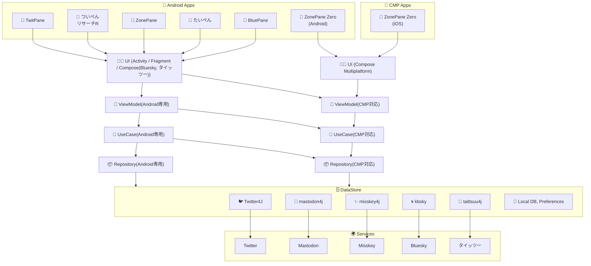
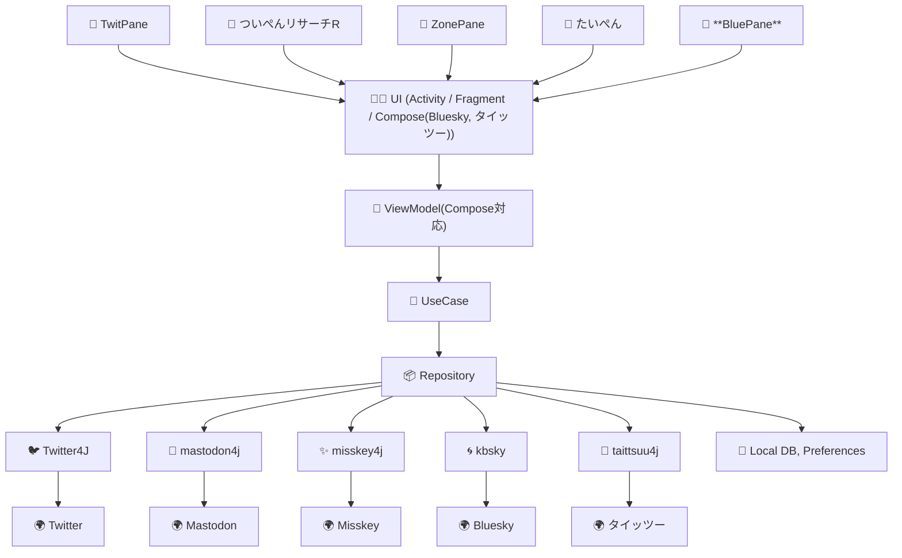
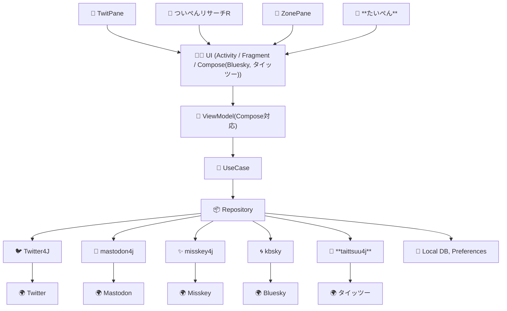
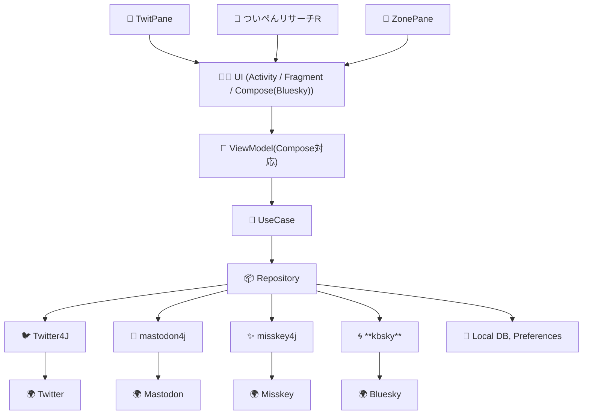
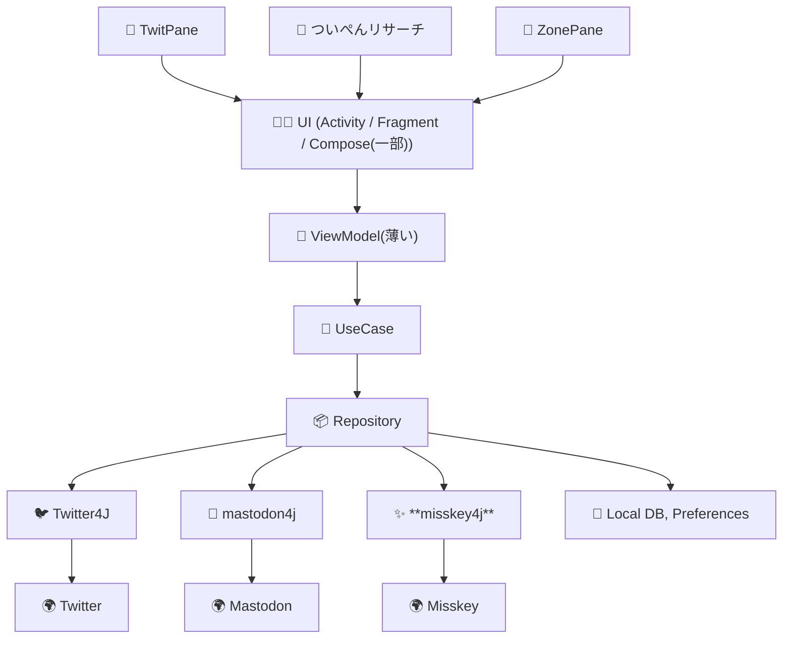
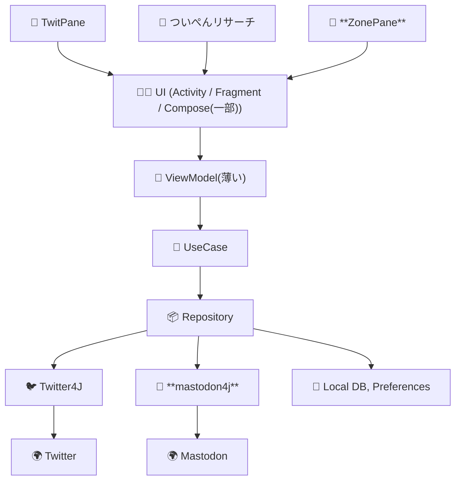
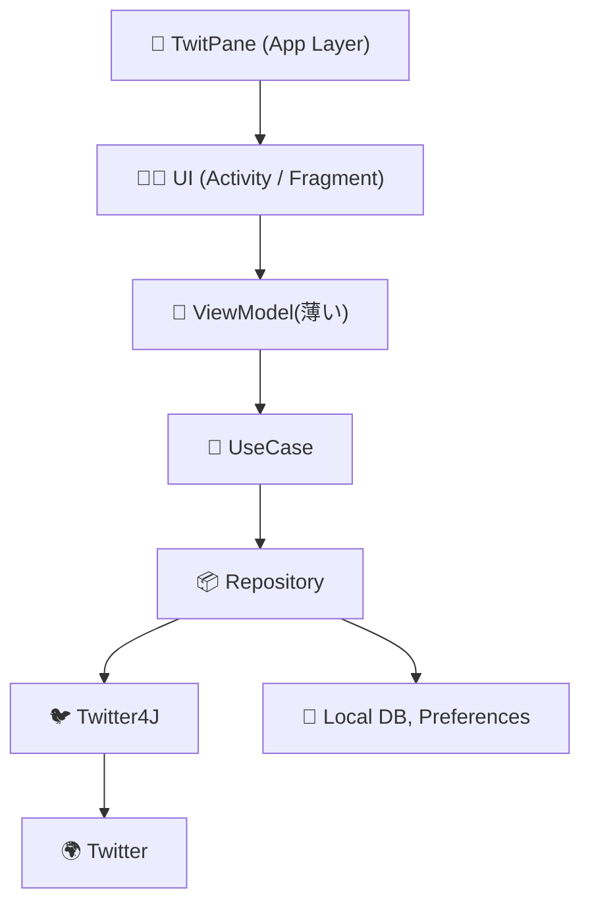

# TwitPane のアーキテクチャ変遷

- ViewModel, UseCase, Repository はこんなに綺麗に Clean Architecture で分離されていない

## TwitPane, ついぺんリサーチR, ZonePane, たいぺん, BluePane (2025年後半〜)
- CMP対応？
 

## TwitPane, ついぺんリサーチR, ZonePane, たいぺん, BluePane (2025年前半〜)
- BluePane(Bluesky専用)
- クロスポスト対応
 

## TwitPane, ついぺんリサーチR, ZonePane, たいぺん (2024年後半〜)
- タイッツー対応(たいぺん)

## TwitPane, ついぺんリサーチR, ZonePane (2024年前半〜)
- Bluesky対応
- Compose で実装

## TwitPane, ついぺんリサーチ, ZonePane (2023年後半〜)
- Misskey対応

## TwitPane, ついぺんリサーチ, ZonePane (2023年前半〜)
- ついぺんリサーチ
- ZonePane - Mastodon 対応

## TwitPane (〜2022年)

