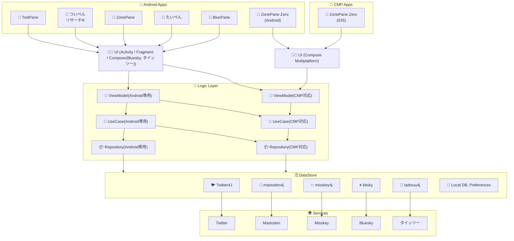
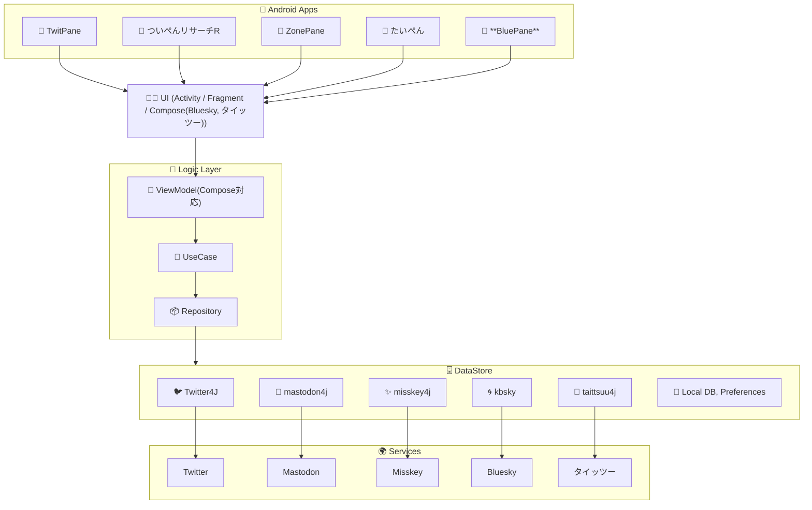
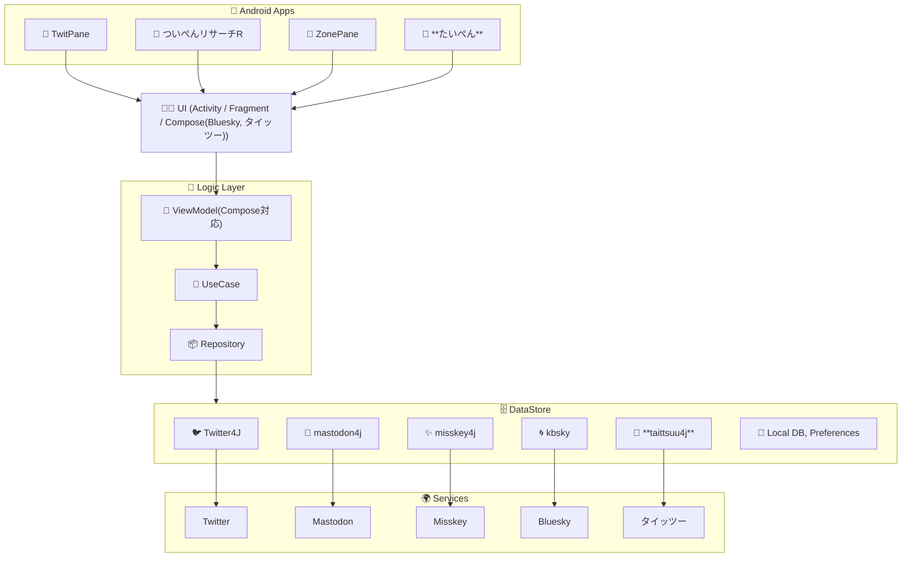
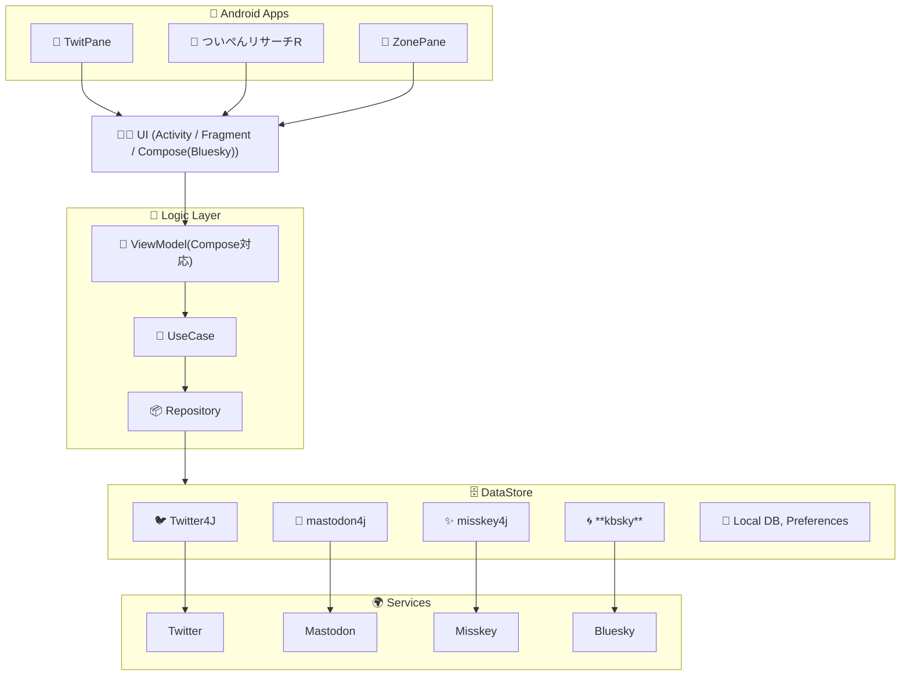
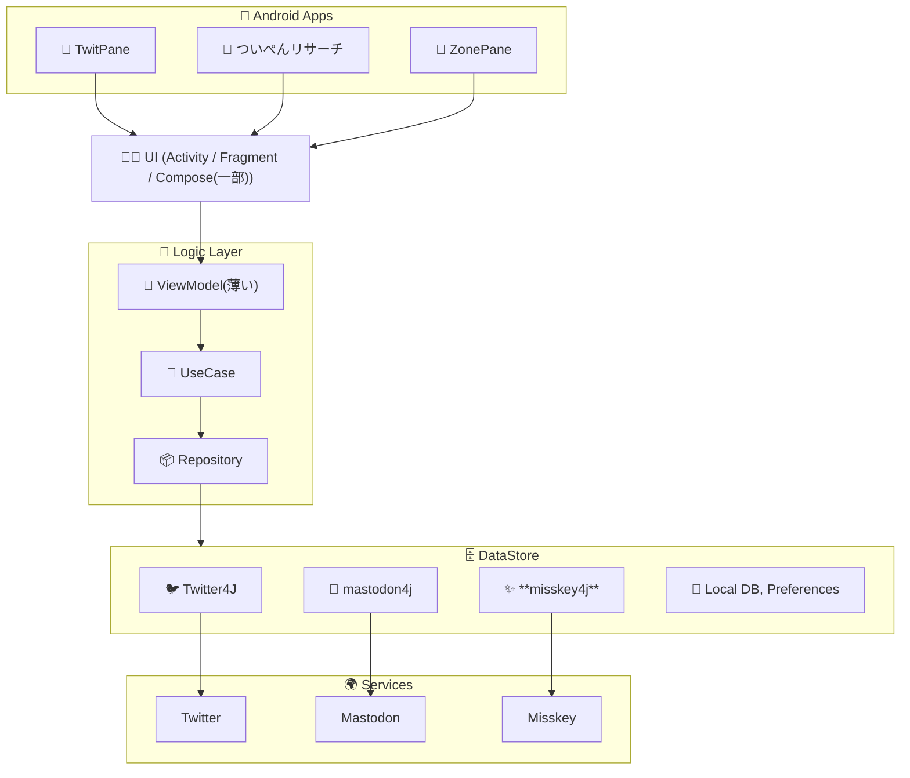
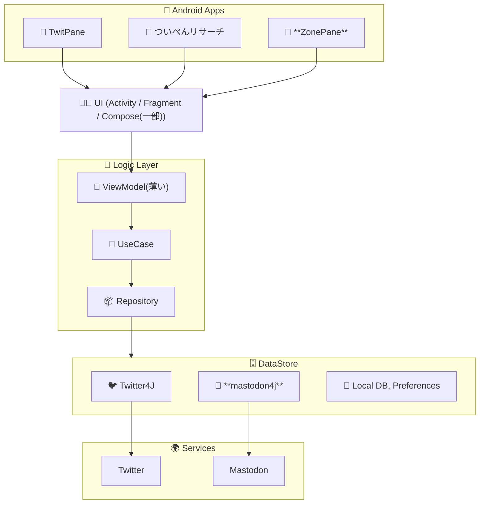
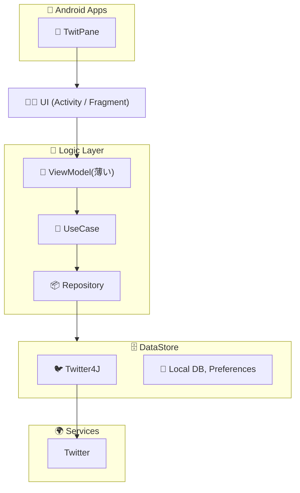

# TwitPane のアーキテクチャ変遷

- ViewModel, UseCase, Repository はこんなに綺麗に Clean Architecture で分離されていない

## 2025年後半: TwitPane, ついぺんリサーチR, ZonePane, たいぺん, BluePane
- CMP対応？
 

## 2025年前半: TwitPane, ついぺんリサーチR, ZonePane, たいぺん, BluePane
- BluePane(Bluesky専用)
- クロスポスト対応
 

## 2024年後半: TwitPane, ついぺんリサーチR, ZonePane, たいぺん
- タイッツー対応(たいぺん)

## 2024年前半: TwitPane, ついぺんリサーチR, ZonePane
- Bluesky対応
- Compose で実装

## 2023年後半: TwitPane, ついぺんリサーチ, ZonePane
- Misskey対応

## 2023年前半: TwitPane, ついぺんリサーチ, ZonePane
- ついぺんリサーチ
- ZonePane - Mastodon 対応

## 2022年: TwitPane

