# TwitPane のアーキテクチャ変遷

## TwitPane (〜2022年)

```mermaid
flowchart TD
  APP["📱 TwitPane (App Layer)"]
  UI["🧑‍💻 UI (Activity / Fragment)"]
  VM["🧠 ViewModel(薄い)"]
  UC["🧭 UseCase"]
  RP["📦 Repository"]
  TW["🐦 Twitter4J"]
  DB["💾 Local DB, Preferences"]

  APP --> UI --> VM --> UC --> RP
  RP --> TW
  RP --> DB
```

## TwitPane, ついぺんリサーチ, ZonePane (2023年前半〜)
- ついぺんリサーチ
- ZonePane - Mastodon 対応

```mermaid
flowchart TD
  TP["📱 TwitPane"]
  TPR["📱 ついぺんリサーチ"]
  ZP["📱 **ZonePane**"]
  UI["🧑‍💻 UI (Activity / Fragment)"]
  VM["🧠 ViewModel(薄い)"]
  UC["🧭 UseCase"]
  RP["📦 Repository"]
  TW["🐦 Twitter4J"]
  MA["🐘 **mastodon4j**"]
  DB["💾 Local DB, Preferences"]

  TP --> UI
  TPR --> UI
  ZP --> UI
  UI --> VM --> UC --> RP
  RP --> TW
  RP --> MA
  RP --> DB

```

## TwitPane, ついぺんリサーチ, ZonePane (2023年後半〜)
- Misskey対応

```mermaid
flowchart TD
  TP["📱 TwitPane"]
  TPR["📱 ついぺんリサーチ"]
  ZP["📱 **ZonePane**"]
  UI["🧑‍💻 UI (Activity / Fragment)"]
  VM["🧠 ViewModel(薄い)"]
  UC["🧭 UseCase"]
  RP["📦 Repository"]
  TW["🐦 Twitter4J"]
  MA["🐘 mastodon4j"]
  MI["✨ **misskey4j**"]
  DB["💾 Local DB, Preferences"]

  TP --> UI
  TPR --> UI
  ZP --> UI
  UI --> VM --> UC --> RP
  RP --> TW
  RP --> MA
  RP --> MI
  RP --> DB
```

