# TwitPane のアーキテクチャ変遷

## TwitPane (〜2022年)

```mermaid
flowchart TD
  APP["📱 TwitPane (App Layer)"]
  UI["🧑‍💻 UI (Activity / Fragment)"]
  VM["🧠 ViewModel(薄い)"]
  UC["🧭 UseCase"]
  RP["📦 Repository"]
  TW["🐦 Twitter4J"]
  DB["💾 Local DB, Preferences"]
  S_TW["🌍 Twitter"]

  APP --> UI --> VM --> UC --> RP
  RP --> TW --> S_TW
  RP --> DB
```

## TwitPane, ついぺんリサーチ, ZonePane (2023年前半〜)
- ついぺんリサーチ
- ZonePane - Mastodon 対応

```mermaid
flowchart TD
  TP["📱 TwitPane"]
  TPR["📱 ついぺんリサーチ"]
  ZP["📱 **ZonePane**"]

  UI["🧑‍💻 UI (Activity / Fragment / Compose(一部))"]
  VM["🧠 ViewModel(薄い)"]
  UC["🧭 UseCase"]
  RP["📦 Repository"]

  TW["🐦 Twitter4J"]
  MA["🐘 **mastodon4j**"]
  DB["💾 Local DB, Preferences"]

  S_TW["🌍 Twitter"]
  S_MA["🌍 Mastodon"]

  TP --> UI
  TPR --> UI
  ZP --> UI

  UI --> VM --> UC --> RP

  RP --> TW --> S_TW
  RP --> MA --> S_MA
  RP --> DB
```

## TwitPane, ついぺんリサーチ, ZonePane (2023年後半〜)
- Misskey対応

```mermaid
flowchart TD
  TP["📱 TwitPane"]
  TPR["📱 ついぺんリサーチ"]
  ZP["📱 ZonePane"]

  UI["🧑‍💻 UI (Activity / Fragment / Compose(一部))"]
  VM["🧠 ViewModel(薄い)"]
  UC["🧭 UseCase"]
  RP["📦 Repository"]

  TW["🐦 Twitter4J"]
  MA["🐘 mastodon4j"]
  MI["✨ **misskey4j**"]
  DB["💾 Local DB, Preferences"]

  S_TW["🌍 Twitter"]
  S_MA["🌍 Mastodon"]
  S_MI["🌍 Misskey"]

  TP --> UI
  TPR --> UI
  ZP --> UI

  UI --> VM --> UC --> RP

  RP --> TW --> S_TW
  RP --> MA --> S_MA
  RP --> MI --> S_MI
  RP --> DB
```

## TwitPane, ついぺんリサーチR, ZonePane (2024年前半〜)
- Bluesky対応
- Compose で実装

```mermaid
flowchart TD
  TP["📱 TwitPane"]
  TPR["📱 ついぺんリサーチR"]
  ZP["📱 ZonePane"]

  UI["🧑‍💻 UI (Activity / Fragment / Compose(Bluesky))"]
  VM["🧠 ViewModel(Compose対応)"]
  UC["🧭 UseCase"]
  RP["📦 Repository"]

  TW["🐦 Twitter4J"]
  MA["🐘 mastodon4j"]
  MI["✨ misskey4j"]
  KB["🌀 **kbsky**"]
  DB["💾 Local DB, Preferences"]

  S_TW["🌍 Twitter"]
  S_MA["🌍 Mastodon"]
  S_MI["🌍 Misskey"]
  S_KB["🌍 Bluesky"]

  TP --> UI
  TPR --> UI
  ZP --> UI

  UI --> VM --> UC --> RP

  RP --> TW --> S_TW
  RP --> MA --> S_MA
  RP --> MI --> S_MI
  RP --> KB --> S_KB
  RP --> DB
```

## TwitPane, ついぺんリサーチR, ZonePane, たいぺん (2024年後半〜)
- タイッツー対応(たいぺん)

```mermaid
flowchart TD
  TP["📱 TwitPane"]
  TPR["📱 ついぺんリサーチR"]
  ZP["📱 ZonePane"]
  TAP["📱 **たいぺん**"]

  UI["🧑‍💻 UI (Activity / Fragment / Compose(Bluesky))"]
  VM["🧠 ViewModel(Compose対応)"]
  UC["🧭 UseCase"]
  RP["📦 Repository"]

  TW["🐦 Twitter4J"]
  MA["🐘 mastodon4j"]
  MI["✨ misskey4j"]
  KB["🌀 kbsky"]
  TT["🧦 **taittsuu4j**"]
  DB["💾 Local DB, Preferences"]

  S_TW["🌍 Twitter"]
  S_MA["🌍 Mastodon"]
  S_MI["🌍 Misskey"]
  S_KB["🌍 Bluesky"]
  S_TT["🌍 タイッツー"]

  TP --> UI
  TPR --> UI
  ZP --> UI
  TAP --> UI

  UI --> VM --> UC --> RP

  RP --> TW --> S_TW
  RP --> MA --> S_MA
  RP --> MI --> S_MI
  RP --> KB --> S_KB
  RP --> TT --> S_TT
  RP --> DB
```

## TwitPane, ついぺんリサーチR, ZonePane, たいぺん, BluePane (2025年前半〜)
- BluePane(Bluesky専用)
- クロスポスト対応

```mermaid
flowchart TD
  %% App Layer
  TP["📱 TwitPane"]
  TPR["📱 ついぺんリサーチR"]
  ZP["📱 ZonePane"]
  TAP["📱 たいぺん"]
  BP["📱 **BluePane**"]

  %% UI, Logic Layer
  UI["🧑‍💻 UI (Activity / Fragment / Compose(Bluesky))"]
  VM["🧠 ViewModel(Compose対応)"]
  UC["🧭 UseCase"]
  RP["📦 Repository"]

  %% DataSource Layer
  TW["🐦 Twitter4J"]
  MA["🐘 mastodon4j"]
  MI["✨ misskey4j"]
  KB["🌀 kbsky"]
  TT["🧦 taittsuu4j"]
  DB["💾 Local DB, Preferences"]

  %% Service Layer
  S_TW["🌍 Twitter"]
  S_MA["🌍 Mastodon"]
  S_MI["🌍 Misskey"]
  S_KB["🌍 Bluesky"]
  S_TT["🌍 タイッツー"]

  %% App connections
  TP --> UI
  TPR --> UI
  ZP --> UI
  TAP --> UI
  BP --> UI

  %% UI to Logic
  UI --> VM --> UC --> RP

  %% Repository to DataSources
  RP --> TW --> S_TW
  RP --> MA --> S_MA
  RP --> MI --> S_MI
  RP --> KB --> S_KB
  RP --> TT --> S_TT
  RP --> DB
```
 

